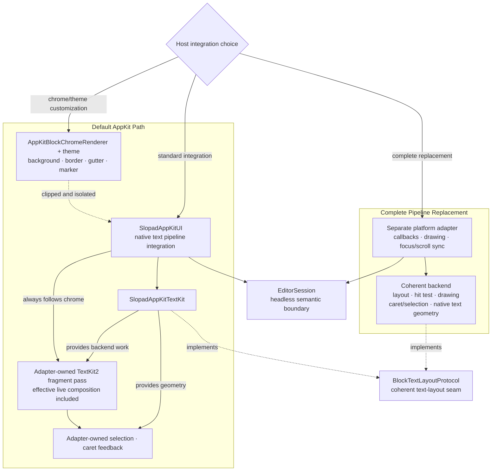

# 0007 - Provide AppKit UI as a Reusable Adapter Package

Date: 2026-07-08

## Status

Accepted

## Context

The debug host proved the AppKit/TextKit2 path, but host code also carries debug HUD
state, local verification helpers, and benchmark-only runners. Downstream macOS apps
need a package they can embed without copying debug or benchmark-only behavior.

The engine still must remain headless: AppKit code should translate native callbacks,
draw session output, and synchronize focus/scroll state, not own canonical document or
selection semantics.

## Decision

Add `SlopadAppKitUI` as a library product and SwiftPM target.

The package owns reusable AppKit adapter code:

- `NSView` + `NSTextInputClient` callback bridging
- key command selector mapping
- mouse/pointer interaction dispatch into `EditorSession`
- active text input and IME/marked-text synchronization
- scroll/focus synchronization
- TextKit-backed canvas drawing
- block-kind chrome customization through `AppKitBlockChromeRenderer`

The block appearance extension point is chrome-only. A host chrome renderer receives block
identity, kind, marker, depth, frame, style, graphics context, and active/selected state.
The render context initializer is internal because only the adapter can assemble a valid
context. It does not receive the Session snapshot, concrete text layouter/renderer, text
render descriptor, or dirty rectangle. `SlopadAppKitUI` clips the hook to its block frame,
saves and restores graphics state, then performs all chrome passes before its TextKit2
fragment-based text drawing, text selection, and caret feedback. Live marked text is
projected into the effective content used by that same adapter-owned text drawing path.

Replacing the complete native text pipeline requires a host to build a custom platform
adapter around `EditorSession` and use a coherent backend that keeps layout, drawing, hit
testing, caret/selection geometry, and native text geometry consistent. It is not exposed
as another high-level paint hook in `SlopadAppKitUI`.

Public document and viewport mutations are atomic adapter operations. `resetDocument`
renders and synchronizes the replacement Session before returning while preserving
whether the editor or an external view owns first responder. `scrollDocument` refreshes
the viewport, visible snapshot, canvas, and snapshot observer before returning without
replacing live marked text, native selection, or responder ownership.

Runtime `TextKitEditorStyle` replacement is also an atomic adapter operation. The adapter
constructs one immutable layout/render/decoration pipeline from the new style, replaces the
Session text-layout backend, and publishes only the synchronized final surface. It preserves
live marked text, native selection, viewport, history, and responder ownership. Every field
currently carried by `TextKitEditorStyle` affects text geometry, so any style inequality
requires full text-layout invalidation. Future paint-only values belong in a separate
appearance contract and must not advance the text-layout revision.

`TextKitEditorStyle` remains a platform-package configuration value. Its public font,
spacing, chrome, and optional BCP-47 language settings use portable scalar/string values;
the AppKit backend alone resolves them to `NSFont`, `NSColor`, and attributed-text keys.

`session`, `scrollView`, raw canvas/native callback methods, native input inspection, and
no-render batching helpers are not public host contracts. They use package access only
when debug or benchmark targets require them; otherwise they remain internal or private.

It depends on `SlopadEngine` and `SlopadAppKitTextKit`. It does not expose `EditorModel`,
`BlockLayout`, canonical `Document`, layout cache, or height-index storage.

## Consequences

- macOS apps can depend on `SlopadAppKitUI` for a working AppKit editor surface.
- Debug-only scenario/HUD state stays in `SlopadDebugApp`.
- Benchmark-only frame loops, CSV output, and forced display flushes stay in
  `SlopadUIBenchmarkApp`.
- AppKit visual customization happens through `AppKitBlockChromeRenderer` and theme
  values, not by moving editor semantics or text-pipeline ownership out of
  `EditorSession` and the adapter.
- Hosts drive the default adapter through synchronized public controller actions and
  observers. Those operations are not extension points for raw key, IME, pointer, reveal,
  or paint policy.
- `Fixtures/DownstreamAppKitHost` compile-checks the intended host contract using ordinary
  public imports only.
- `AppKitBlockRenderer`, `AppKitBlockRenderContext`, and `drawBlock(_:)` are replaced by
  the chrome-specific names. This is intentionally source breaking: retaining the old
  whole-block hook would keep a path that can suppress native text/input feedback or draw
  it twice. Hosts migrate only their background, border, gutter, and marker drawing to
  `drawChrome(_:)`.
- A future UIKit adapter should follow the same rule: platform package owns native
  callback/drawing/focus glue while the engine owns semantic editing behavior.
