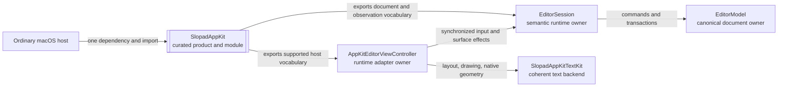

# 0010 - Provide an AppKit Platform Facade

Date: 2026-07-23

## Status

Accepted

## Context

The default macOS integration is one coherent platform stack: `SlopadAppKitUI` owns the
native AppKit callback and surface lifecycle while `SlopadAppKitTextKit` supplies the
matching TextKit2 geometry and drawing backend. Ordinary downstream apps nevertheless had
to depend on and import `SlopadEngine`, `SlopadAppKitUI`, and `SlopadAppKitTextKit`
individually. That exposed assembly details and made low-level engine input and adapter
plumbing look like the normal host contract.

The default controller also publicly accepted raw `EditorInputEvent` values and exposed
its `EditorViewport`. A host could therefore synthesize native-style input while choosing
viewport facts that the controller already owns. The same raw entry point was useful to
commit live composition before persistence or document replacement, but that lifecycle
need did not justify publishing the complete pointer, command, and IME transport surface.

The simplification must not collapse engine semantics into AppKit, turn the text backend
into a paint hook, or remove the lower-level contracts needed by complete custom adapters
and existing integrations.

## Decision

Add `SlopadAppKit` as the recommended library product and module for ordinary macOS hosts.
Its target curates public controller, action, style, chrome, document, selection, update,
and snapshot vocabulary from the existing owners. It depends on `SlopadAppKitUI` and
`SlopadEngine`; the UI adapter continues to depend on `SlopadAppKitTextKit`, so the product
assembles the complete default AppKit + TextKit2 stack without adding a runtime owner.

An ordinary host uses one product dependency and one import:

```swift
.product(name: "SlopadAppKit", package: "Slopad")
```

```swift
import SlopadAppKit
```

The facade is a compile-time assembly boundary, not a runtime owner:



Only the arrows below `Controller` and `Engine` describe runtime work. `SlopadAppKit`
does not wrap those objects, duplicate their state, or become another callback hop.

`AppKitEditorViewController` owns one `AppKitTextSystem`. A single
`AppKitEditorStyle` configures the TextKit2 layouter, fragment renderer, IME decoration
geometry, and the style supplied to the chrome pass. Style replacement constructs and
installs that coherent unit atomically so measurement, hit testing, drawing, and native
feedback do not observe different configurations.

The controller's ordinary public input boundary is synchronized and context-free:

- `perform(_:)` accepts `AppKitEditorAction`; the controller captures its own current
  viewport when the engine command needs geometry. If native composition is live, the
  controller commits and synchronizes it before applying the requested action.
- `commitActiveComposition()` explicitly commits live marked text for persistence,
  document switching, or lifecycle flushes without exposing raw IME input. The adapter
  synchronizes back from the canonical result so Markdown shortcut normalization cannot
  leave stale native text or selection.
- `focus`, `resetDocument`, `scrollDocument`, `updateEditorStyle`, update observation,
  render snapshots, and `EditorDocumentSnapshot` remain public synchronized host
  contracts.
- Raw `handleInput(EditorInputEvent, ...)` and `currentViewport` are not public controller
  APIs. Native key, pointer, command-selector, and IME callbacks remain adapter-owned.

This does not narrow the headless extension boundary. `EditorSession.handleInput(_:)`,
`EditorInputEvent`, `EditorViewport`, and `BlockTextLayoutProtocol` remain public through
`SlopadEngine` for hosts implementing a complete custom adapter. The
`SlopadAppKitUI`, `SlopadAppKitTextKit`, and `SlopadEngine` library products also remain
available as advanced and compatibility seams.

The source migration follows the ownership boundary:

| Previous ordinary-host surface | New surface | Result |
| --- | --- | --- |
| Three product dependencies and imports | `SlopadAppKit` | Default stack assembly becomes library-owned |
| `TextKitEditorStyle` | `AppKitEditorStyle` | Style names the complete platform configuration rather than one backend |
| `handleInput(.command(...))` | `perform(AppKitEditorAction)` | Viewport and synchronized surface work remain adapter-owned |
| `handleInput(.commitComposition)` | `commitActiveComposition()` | Session and native marked state settle as one public operation |
| Controller `currentViewport()` | No ordinary-host equivalent | Raw geometry input is not host policy |

## Consequences

- Ordinary macOS apps no longer encode the internal three-product assembly in their
  manifests and imports.
- The facade is a curated source-level contract, not a new state owner. Runtime ownership
  remains in `EditorSession`, `AppKitEditorViewController`, and the existing model/layout
  layers.
- Hosts migrate ordinary programmatic commands to `perform(_:)` and lifecycle composition
  flushes to `commitActiveComposition()`. Code implementing a complete adapter continues
  to import `SlopadEngine` and use raw engine inputs directly.
- The facade exposes the complete `EditorDocumentSnapshot` and committed revision signal,
  so simplifying imports does not weaken viewport-independent persistence.
- `AppKitBlockChromeRenderer` remains decoration-only. The facade does not add a partial
  text-renderer replacement point or split the coherent TextKit2 geometry contract.
- `Fixtures/DownstreamAppKitHost` compile-checks the one-product, one-import contract with
  ordinary public access only. Internal package tests and development targets may still
  consume underlying targets directly when they are testing those owner seams.
