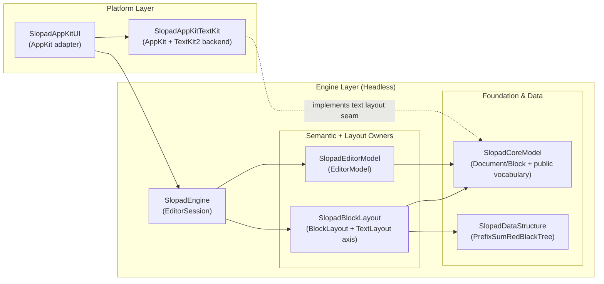

<p align="center">
  
</p>

<h1 align="center">Slopad</h1>

<p align="center">
  WIP Swift block text editor app, currently focused on its reusable editor engine.
</p>

<p align="center">
  
  
  
  
</p>

Slopad is a work-in-progress Swift app project for a block text editor. The app layer is
still early; most of the current codebase is the reusable editor foundation that the app
will use.

That foundation is `SlopadEngine`: a headless block editor engine for
Notion/Craft-style editors where the document is a tree of blocks, the engine owns editing
semantics, and platform code supplies native input, drawing, and text layout.

The engine is designed to stay platform-independent. An embedding app supplies two edge
pieces: a native UI layer that translates platform callbacks into engine inputs, and a
text layout backend that satisfies `BlockTextLayoutProtocol`.

The current project proves that path on macOS with AppKit UI and a TextKit2 text layout
backend. `SlopadAppKitUI` is the reusable AppKit adapter around the engine; it is not the
engine model itself.

## Demo


```sh
swift run SlopadDebugApp
```

## Current Focus

SlopadEngine owns the semantic editor model:

- block document state and block identity
- caret, text selection, and block selection
- keyboard, pointer, native command, and IME/composition semantics
- command application, undo/redo, and semantic change projection
- block layout orchestration, hit testing, reveal geometry, and render snapshots

The engine does not own platform widgets. A host view receives native callbacks,
translates them into engine input values, asks the engine for layout/render/hit-test
facts, and draws using the platform backend it chose.

## Engine Architecture



### Layer Responsibilities

| Layer             | Owner                 | Responsibility                                                                                                                                                        |
| ----------------- | --------------------- | --------------------------------------------------------------------------------------------------------------------------------------------------------------------- |
| Platform Layer    | `SlopadAppKitUI`      | Reusable AppKit callback, drawing, focus, scroll, and block chrome adapter around `EditorSession`.                                                                    |
| Platform Layer    | `SlopadAppKitTextKit` | AppKit/TextKit2 implementation of the text layout seam: measurement, line fragments, caret/selection rects, hit testing, and drawing helpers.                         |
| Engine Layer      | `SlopadEngine`        | Host-facing `EditorSession` facade. It accepts native-independent input, composes semantic and layout owners, and returns render, hit-test, reveal, and redraw facts. |
| Engine Layer      | `SlopadEditorModel`   | Canonical document, selection, command, transaction, history, and semantic change owner.                                                                              |
| Engine Layer      | `SlopadBlockLayout`   | Visible order, y/height geometry, invalidation, reveal/hit-test geometry, marker projection, text-layout cache, and block height index owner.                         |
| Foundation & Data | `SlopadCoreModel`     | Shared public vocabulary, canonical `Document`/`Block` values, and backend seam values such as `BlockTextLayoutProtocol`.                                             |
| Foundation & Data | `SlopadDataStructure` | Pure storage such as `PrefixSumRedBlackTree`, with no editor, layout, or platform vocabulary.                                                                         |

`SlopadEditorModel` and `SlopadBlockLayout` do not import each other. `EditorSession`
combines their results and translates semantic changes into layout invalidation.

SwiftPM keeps these responsibilities in separate targets. See `Package.swift` for the
exact product and target list.

## Development Targets

The repository also keeps benchmark and debug targets for development convenience. They
validate the current AppKit/TextKit2 path and performance behavior, but they do not define
engine semantics.

Benchmark targets:

- `SlopadUIBenchmarkApp`: AppKit UI benchmark harness for frame loops, CSV output, and
  display flush checks.
- `SlopadHeightBenchmark`: block height/index benchmark executable under `Benchmarks/`.
- `SlopadSessionBenchmark`: engine/session benchmark executable under `Benchmarks/`.

Debug target:

- `SlopadDebugApp`: macOS reference/debug host for scenarios, screenshots, and state
  assertions.

## Documentation

- `AGENTS.md`: working conventions for agents.
- `ADR/`: accepted architecture decisions.
- `docs/LOOP_REQUEST_TEMPLATE.md`: copy-paste template for bounded loop requests.
- `docs/ROADMAP.md`: achieved milestones, current product direction, and open risks.
- `docs/LESSONS_LEARNED.md`: failure patterns from past cleanup/refactor work.

## Development Checks

```sh
swift package dump-package
swift test --quiet
swift build --product SlopadAppKitTextKit --quiet
swift build --product SlopadAppKitUI --quiet
swift build --product SlopadDebugApp --quiet
swift build --product SlopadUIBenchmarkApp --quiet
git diff --check
```
