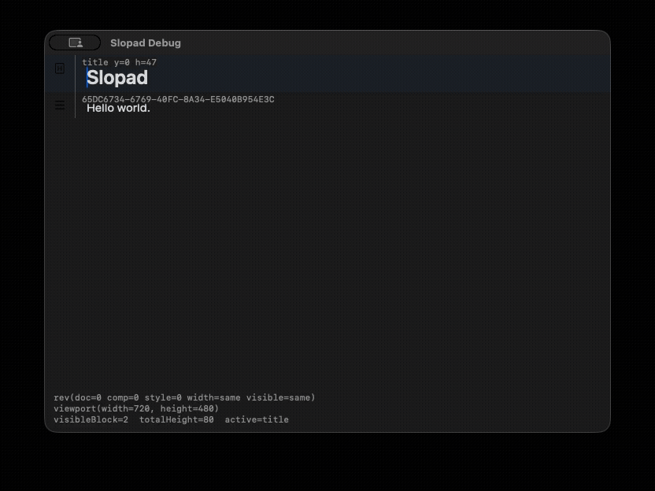
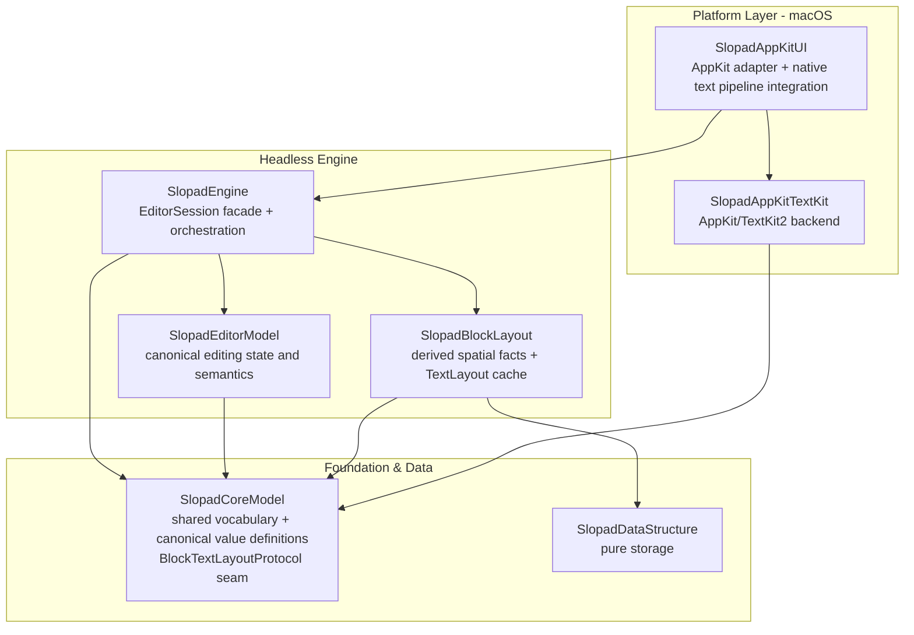

<p align="center">
  
</p>

<h1 align="center">Slopad</h1>

<p align="center">
  WIP Swift block text editor app, currently focused on its reusable editor engine.
</p>

<p align="center">
  
  
  
  
</p>

Slopad is a work-in-progress Swift app project for a block text editor. The app layer is
still early; most of the current codebase is the reusable editor foundation that the app
will use.

That foundation is `SlopadEngine`: a headless block editor engine for
Notion/Craft-style editors where the document is a tree of blocks, the engine owns editing
semantics, and platform code supplies native input, drawing, and text layout.

The engine is designed to stay platform-independent. A complete platform integration has
two coherent edge pieces: a native UI adapter that translates platform callbacks into
engine inputs, and a text layout backend that satisfies `BlockTextLayoutProtocol`.

The current project proves that path on macOS with AppKit UI and a TextKit2 text layout
backend. The default `SlopadAppKitUI` path assembles those pieces and owns native text
pipeline integration; downstream hosts normally customize only theme and block chrome.
A host supplies a different pair only when it builds a complete custom platform adapter.

## Demo



```sh
swift run SlopadDebugApp
```

## Current Focus

SlopadEngine owns the semantic editor model:

- block document state and block identity
- caret, text selection, and block selection
- keyboard, pointer, native command, and IME/composition semantics
- command application, undo/redo, and semantic change projection
- block layout orchestration, hit testing, reveal geometry, and render snapshots

The engine does not own platform widgets. A host view receives native callbacks,
translates them into engine input values, asks the engine for layout/render/hit-test
facts, and applies those facts through its platform adapter. In the default macOS path,
`SlopadAppKitUI` performs that work with `SlopadAppKitTextKit`.

## Engine Architecture



Arrows show direct SwiftPM target dependencies. Debug apps, benchmarks, tests, and the
downstream fixture are outer-edge consumers and are omitted from the production graph.

### Layer Responsibilities

| Layer             | Owner                 | Responsibility                                                                                                                                                        |
| ----------------- | --------------------- | --------------------------------------------------------------------------------------------------------------------------------------------------------------------- |
| Platform Layer    | `SlopadAppKitUI`      | Reusable AppKit callback, IME transport, native text pipeline, fragment/feedback drawing order, focus/scroll synchronization, and block chrome adapter.              |
| Platform Layer    | `SlopadAppKitTextKit` | AppKit/TextKit2 backend for measurement, line fragments, caret/selection rects, hit testing, attributed content, and drawing helpers; it owns no native input host.   |
| Engine Layer      | `SlopadEngine`        | Host-facing `EditorSession` facade. It accepts native-independent input, composes semantic and layout owners, and returns render, hit-test, reveal, and redraw facts. |
| Engine Layer      | `SlopadEditorModel`   | Canonical document, selection, command, transaction, history, and semantic change owner.                                                                              |
| Engine Layer      | `SlopadBlockLayout`   | Visible order, y/height geometry, invalidation, reveal/hit-test geometry, marker projection, text-layout cache, and block height index owner.                         |
| Foundation & Data | `SlopadCoreModel`     | Shared public vocabulary, canonical `Document`/`Block` values, and backend seam values such as `BlockTextLayoutProtocol`.                                             |
| Foundation & Data | `SlopadDataStructure` | Pure storage such as `PrefixSumRedBlackTree`, with no editor, layout, or platform vocabulary.                                                                         |

`SlopadEditorModel` and `SlopadBlockLayout` do not import each other. `EditorSession`
combines their results and translates semantic changes into layout invalidation.

### Architecture Philosophy

- One meaning has one authority. Projections and caches may describe canonical state but
  do not become competing owners.
- The engine owns editing meaning; platform adapters own native callback transport,
  drawing, focus, and scroll mechanisms.
- A text backend keeps measurement, line fragments, hit testing, caret/selection rects,
  and drawing coherent for the same effective text request; it is not a paint callback.
- SwiftPM dependencies and access levels enforce the architecture: `public` is a host
  contract, `package` is a real cross-target owner interface, and implementation details
  stay target-internal.
- Public AppKit operations are atomic adapter boundaries whose Session snapshot,
  viewport, canvas, native input, focus, and observer effects agree when they return.

See [`docs/ARCHITECTURE.md`](docs/ARCHITECTURE.md) for runtime ownership, extension versus
replacement boundaries, and the change decision checklist.

On macOS, host-defined block appearance is deliberately limited to chrome through
`AppKitBlockChromeRenderer`: backgrounds, borders, gutter markers, and similar decoration.
`SlopadAppKitUI` clips and isolates that hook, then always performs its TextKit2
fragment-based text drawing plus text-selection and caret feedback. Live marked text is
included in the effective content sent through the same adapter-owned text drawing path.

A host that needs to replace the entire native text pipeline must build its own platform
adapter around `EditorSession`. That adapter must keep layout, drawing, hit testing,
caret/selection geometry, and native text geometry coherent. The high-level chrome hook
is not a partial text-renderer replacement point.

Public controller mutations are synchronized host operations. `resetDocument` returns
only after the replacement Session snapshot, canvas, native text surface, responder state,
and snapshot observer are synchronized. `scrollDocument` returns only after the viewport,
visible snapshot, canvas, and snapshot observer are synchronized, while preserving live
marked text, native selection, and current responder ownership. `updateEditorStyle`
atomically replaces the AppKit text layout/drawing pipeline and synchronizes the resulting
surface with the same preservation guarantees. Unsynchronized `...WithoutRendering`
helpers are package-only development hooks.

SwiftPM keeps these responsibilities in separate targets. See `Package.swift` for the
exact product and target list.

## Development Targets

The repository also keeps benchmark and debug targets for development convenience. They
validate the current AppKit/TextKit2 path and performance behavior, but they do not define
engine semantics.

Benchmark targets:

- `SlopadUIBenchmarkApp`: AppKit UI benchmark harness for frame loops, CSV output, and
  display flush checks.
- `SlopadHeightBenchmark`: block height/index benchmark executable under `Benchmarks/`.
- `SlopadSessionBenchmark`: engine/session benchmark executable under `Benchmarks/`.

Debug target:

- `SlopadDebugApp`: macOS reference/debug host for scenarios, screenshots, and state
  assertions.

## Documentation

- `AGENTS.md`: working conventions for agents.
- `docs/ARCHITECTURE.md`: detailed target graph, runtime ownership, platform extension
  boundary, and architecture philosophy.
- `ADR/`: accepted architecture decisions.
- `docs/LOOP_REQUEST_TEMPLATE.md`: copy-paste template for bounded loop requests.
- `docs/ROADMAP.md`: achieved milestones, current product direction, and open risks.
- `docs/LESSONS_LEARNED.md`: failure patterns from past cleanup/refactor work.

## Development Checks

`Fixtures/DownstreamAppKitHost` is a compile-only consumer of the intended public host
surface. It must not rely on `@testable` imports or package-only APIs.

```sh
swift package dump-package
swift test --quiet
swift build --product SlopadAppKitTextKit --quiet
swift build --product SlopadAppKitUI --quiet
swift build --product SlopadDebugApp --quiet
swift build --product SlopadUIBenchmarkApp --quiet
swift build --package-path Fixtures/DownstreamAppKitHost --product DownstreamAppKitHost --quiet
git diff --check
```
