# AppKit UI Benchmark Results

Date: 2026-07-06

## Scope

This document records UI benchmark results using `SlopadUIBenchmarkApp` as the real
AppKit reference host.

This is not an engine-only benchmark. Each measured frame includes the host path:

- AppKit scroll/input/pointer preparation for each scenario.
- `EditorSession` input handling when the scenario mutates editor state.
- `renderAndSyncSurface`: `EditorSession.render`, layout, visible block snapshot
  creation, canvas sizing, active native input sync, and dirty rect invalidation.
- Forced AppKit display flushing through `displayIfNeeded`, so `draw(_:)` and TextKit2
  drawing cost are included.

The storage implementation decision belongs to `HEIGHT_INDEX_STORAGE_EXPERIMENT.md`. This
document only records how that cost appears in the AppKit host frame path.

## Frame Pipeline

```mermaid
flowchart LR
    Scenario["scenario preparation<br/>scroll/input/pointer"]
    Operation["EditorSession.handleInput<br/>avgOperationMs"]
    RenderSync["renderAndSyncSurface<br/>avgRenderAndSyncMs"]
    Render["EditorSession.render"]
    Layout["BlockLayout<br/>height index + visible range"]
    TextLayout["SlopadAppKitTextKit<br/>text layout/cache"]
    Snapshot["EditorSessionSnapshot<br/>visible blocks + geometry"]
    Surface["canvas resize<br/>active input sync<br/>setNeedsDisplay"]
    Display["displayIfNeeded<br/>avgDisplayMs"]
    Draw["draw(_:)<br/>avgDrawMs"]
    Chrome["host block chrome hook"]
    TextDraw["adapter-owned<br/>TextKit2 fragment-based text drawing"]
    Decoration["adapter-owned<br/>text selection + caret"]

    Scenario --> Operation --> RenderSync
    RenderSync --> Render --> Layout --> TextLayout --> Snapshot --> Surface
    Surface --> Display --> Draw --> Chrome --> TextDraw --> Decoration
```



`scroll` is special. The benchmark changes scroll position before the timed frame. Read
`scroll` numbers as the cost to render/draw the new viewport, not as native scroll event
handling cost.

## Metrics

| Metric               | Meaning                                                                                                                                       |
| -------------------- | --------------------------------------------------------------------------------------------------------------------------------------------- |
| `avgFPS`             | `1000 / avgFrameMs`. Average throughput; higher is better.                                                                                    |
| `avgFrameMs`         | Average total measured frame time. Includes operation, render/sync, display, draw, and small harness overhead.                               |
| `p95FrameMs`         | 95th percentile of total frame time. More important than `avgFPS` for quickly spotting visible stutter.                                      |
| `avgOperationMs`     | Scenario operation time before render/sync. Native insert, composition update, block selection, and block reorder land here.                 |
| `avgRenderAndSyncMs` | Engine render and host surface sync time through `renderAndSyncSurface`.                                                                      |
| `avgDisplayMs`       | Time spent forcing an AppKit display flush.                                                                                                  |
| `avgDrawMs`          | Time spent inside the canvas draw callback.                                                                                                  |
| `over16ms`           | Number of frames whose total `frameMs` exceeded 16.67ms.                                                                                     |
| `over33ms`           | Number of frames whose total `frameMs` exceeded 33.33ms.                                                                                     |
| `heightIndex*Count`  | Height-index operation counts recorded by benchmark instrumentation, including rebuild, insert, remove, move, and height update operations. |

In the frame-budget tables below, the 16.67ms threshold is always based on total
`frameMs`, not render/sync time alone.

## Baseline Files

- `Benchmarks/Baselines/appkit-ui-rbtree-20260706.csv`: raw frame samples using the
  default `RBTreeBlockHeightIndexStorage`.
- `Benchmarks/Baselines/appkit-ui-array-20260706.csv`: raw frame samples built with
  `-Xswiftc -DSLOPAD_HEIGHT_INDEX_ARRAY`.
- `Benchmarks/Baselines/appkit-ui-summary-20260706.csv`: aggregate metrics by storage,
  scenario, and block count.
- `Benchmarks/Baselines/appkit-ui-storage-compare-20260706.csv`: side-by-side AppKit UI
  frame comparison.
- `Benchmarks/Baselines/appkit-ui-subtree-rbtree-20260706.csv`: raw subtree samples using
  the default `RBTreeBlockHeightIndexStorage`.
- `Benchmarks/Baselines/appkit-ui-subtree-array-20260706.csv`: raw subtree samples built
  with `-Xswiftc -DSLOPAD_HEIGHT_INDEX_ARRAY`.
- `Benchmarks/Baselines/appkit-ui-subtree-summary-20260706.csv`: aggregate metrics for
  subtree UI scenarios.
- `Benchmarks/Baselines/appkit-ui-subtree-storage-compare-20260706.csv`: subtree UI
  side-by-side comparison.

Each scenario ran 60 measured frames at block counts `100`, `1000`, and `10000`.

## Scenarios

- `scroll`: changes viewport position from top to bottom, then renders/displays the new
  viewport.
- `native-insert`: sends text insertion through the active native input path.
- `composition`: updates the active block's live composition overlay.
- `height-expansion`: inserts text so one block wraps, grows in height, and pushes
  downstream y positions.
- `block-selection`: selects a block through the gutter pointer path.
- `block-reorder`: drags the selected single block near adjacent visible blocks.
- `mixed`: cycles through scroll, insert, composition, block selection, height expansion,
  and block reorder.
- `subtree-delete`: builds a tree fixture, selects a visible subtree range, then deletes
  it. Because deletion is destructive, the document is reset before each measured frame.
- `subtree-reorder`: uses the same tree fixture, selects a visible subtree range, then
  drags it near an outside block.

Subtree scenarios use the same subtree-size rule as the session benchmark.

| Total block count | Selected/changed subtree node count |
| ----------------: | -----------------------------------: |
|               100 |                                    6 |
|              1000 |                                   50 |
|             10000 |                                  200 |

## Commands

Default RBTree storage:

```sh
swift run -c release -Xswiftc -DSLOPAD_BENCHMARK_INSTRUMENTATION \
  SlopadUIBenchmarkApp \
  --output /tmp/slopad-ui-bench-20260706/rbtree-scroll-10000.csv \
  --block-count 10000 \
  --frames 60 \
  --scenario scroll
```

Array storage comparison build:

```sh
swift run -c release \
  -Xswiftc -DSLOPAD_BENCHMARK_INSTRUMENTATION \
  -Xswiftc -DSLOPAD_HEIGHT_INDEX_ARRAY \
  SlopadUIBenchmarkApp \
  --output /tmp/slopad-ui-bench-20260706/array-scroll-10000.csv \
  --block-count 10000 \
  --frames 60 \
  --scenario scroll
```

The full sweep used the same command shape for these combinations:

```text
scenarios: scroll,native-insert,composition,height-expansion,block-selection,block-reorder,mixed
blockCounts: 100,1000,10000
frames: 60
storages: default RBTree, SLOPAD_HEIGHT_INDEX_ARRAY
```

The subtree follow-up used these combinations:

```text
scenarios: subtree-delete,subtree-reorder
blockCounts: 100,1000,10000
frames: 60
storages: default RBTree, SLOPAD_HEIGHT_INDEX_ARRAY
```

Pass `--subtree-node-count N` to inspect subtree-size sensitivity within a fixed document
size.

## Default UI Results

The default build uses `RBTreeBlockHeightIndexStorage`. Each cell is
`avgFPS / p95FrameMs`: average throughput first, then the 95th percentile of total frame
time.

| Scenario           |      100 blocks |     1000 blocks |    10000 blocks |
| ------------------ | --------------: | --------------: | --------------: |
| `scroll`           | 134.5 / 11.52ms |  136.8 / 8.59ms | 112.9 / 10.96ms |
| `native-insert`    |  156.2 / 7.75ms |  146.8 / 8.03ms | 116.0 / 10.34ms |
| `composition`      |  152.2 / 7.55ms |  159.8 / 6.61ms |  148.3 / 7.25ms |
| `height-expansion` | 130.3 / 10.59ms | 121.8 / 10.85ms | 112.2 / 11.33ms |
| `block-selection`  |  158.0 / 6.85ms |  166.8 / 6.63ms |  171.4 / 6.15ms |
| `block-reorder`    |  159.6 / 6.98ms |  145.9 / 8.03ms |  93.9 / 12.35ms |
| `mixed`            |  159.5 / 7.83ms |  187.2 / 9.02ms | 183.4 / 11.03ms |

At 10000 blocks, every default non-subtree scenario stayed under the 16.67ms frame budget
at p95, and `0 / 60` total frames exceeded 16.67ms.

## 10000-Block Frame Breakdown

This table shows total frame time and the main slices together. Render/sync time and total
frame-budget overrun counts are intentionally separated.

| Storage | Scenario          | avgFrameMs | p95FrameMs | avgOperationMs | avgRenderAndSyncMs | avgDisplayMs | avgDrawMs | Frames over 16.67ms |
| ------- | ----------------- | ---------: | ---------: | -------------: | -----------------: | -----------: | --------: | ------------------: |
| RBTree  | `composition`     |      6.742 |      7.245 |          0.003 |              0.157 |        6.581 |     6.253 |              0 / 60 |
| RBTree  | `native-insert`   |      8.617 |     10.336 |          2.086 |              0.190 |        6.341 |     6.022 |              0 / 60 |
| RBTree  | `block-reorder`   |     10.648 |     12.346 |          1.626 |              2.483 |        6.539 |     6.182 |              0 / 60 |
| RBTree  | `subtree-delete`  |      8.670 |      9.593 |          5.785 |              2.549 |        0.335 |     0.206 |              0 / 60 |
| RBTree  | `subtree-reorder` |     18.824 |     23.615 |          6.543 |              4.290 |        7.991 |     7.555 |             60 / 60 |
| Array   | `subtree-delete`  |     51.148 |     53.966 |          5.266 |             45.625 |        0.256 |     0.164 |             60 / 60 |
| Array   | `subtree-reorder` |    112.534 |    123.011 |          6.649 |             97.055 |        8.829 |     8.332 |             60 / 60 |

Interpretation:

- `composition` is mostly AppKit/TextKit display and drawing cost.
- `native-insert` shows input cost, but display/draw still dominates total frame time.
- Single-block `block-reorder` starts to show render/sync cost, but remains inside budget.
- RBTree `subtree-reorder` has much lower render/sync cost than the array build, but still
  exceeds 16.67ms in this UI host.
- Array subtree mutation is dominated by render/sync because layout consumes many
  height-index remove/move operations after the structural change.

## UI Host Storage Comparison

The 10000-block non-subtree comparison is based on average total frame time. `Delta frame
pct` is `arrayAvgFrameMs - rbtreeAvgFrameMs`. Negative means the array build has lower
average frame time; positive means the RBTree build has lower average frame time.

| Scenario           | RBTree avgFPS | Array avgFPS | Delta frame pct | UI result      |
| ------------------ | ------------: | -----------: | --------------: | -------------- |
| `scroll`           |         112.9 |        121.2 |           -6.8% | array faster   |
| `native-insert`    |         116.0 |        132.1 |          -12.1% | array faster   |
| `composition`      |         148.3 |        150.2 |           -1.3% | similar        |
| `height-expansion` |         112.2 |         97.2 |           15.4% | RBTree faster  |
| `block-selection`  |         171.4 |        149.8 |           14.5% | RBTree faster  |
| `block-reorder`    |          93.9 |         96.7 |           -2.9% | similar        |
| `mixed`            |         183.4 |        178.5 |            2.7% | similar        |

The non-subtree UI host comparison is mixed. Array is faster in some display/read-heavy
paths; RBTree is faster in height expansion and block selection; several rows are
tie-level. Read this table only as UI frame evidence. The storage decision belongs to
`HEIGHT_INDEX_STORAGE_EXPERIMENT.md`.

At 10000 blocks, subtree work shows storage pressure clearly in the UI path too.

| Scenario          | Storage | avgFrameMs | p95FrameMs | avgRenderAndSyncMs | Frames over 16.67ms |
| ----------------- | ------- | ---------: | ---------: | -----------------: | ------------------: |
| `subtree-delete`  | RBTree  |      8.670 |      9.593 |              2.549 |              0 / 60 |
| `subtree-delete`  | Array   |     51.148 |     53.966 |             45.625 |             60 / 60 |
| `subtree-reorder` | RBTree  |     18.824 |     23.615 |              4.290 |             60 / 60 |
| `subtree-reorder` | Array   |    112.534 |    123.011 |             97.055 |             60 / 60 |

## Interpretation

- The default AppKit UI path is healthy for the measured non-subtree scenarios at 10000
  blocks. Every p95 frame time stays below 16.67ms.
- A large part of ordinary frame time is AppKit/TextKit display and drawing. In this
  sweep, much of `composition`, `block-selection`, and `native-insert` is display/draw
  bound.
- `scroll` stays inside budget at 10000 blocks and updates exact heights for newly exposed
  blocks through lazy measurement.
- Single-block reorder is a useful UI pressure case, but it does not represent large
  structural selections. Subtree delete/reorder are the structural UI cases.
- The AppKit UI sweep should be read together with `HEIGHT_INDEX_STORAGE_EXPERIMENT.md`,
  but it does not own the storage default decision. This document records only what was
  visible in the reference host frame path.
