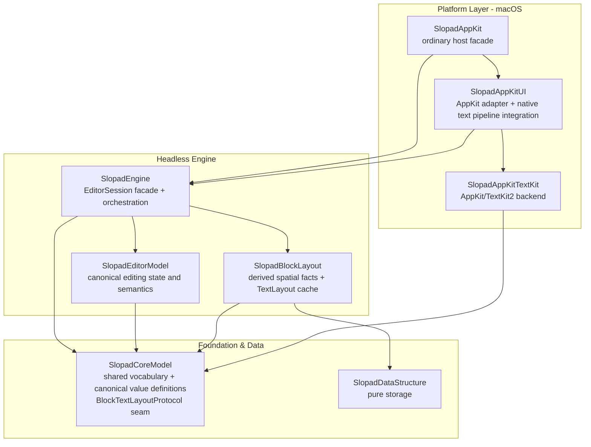
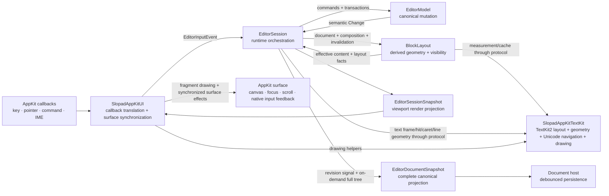
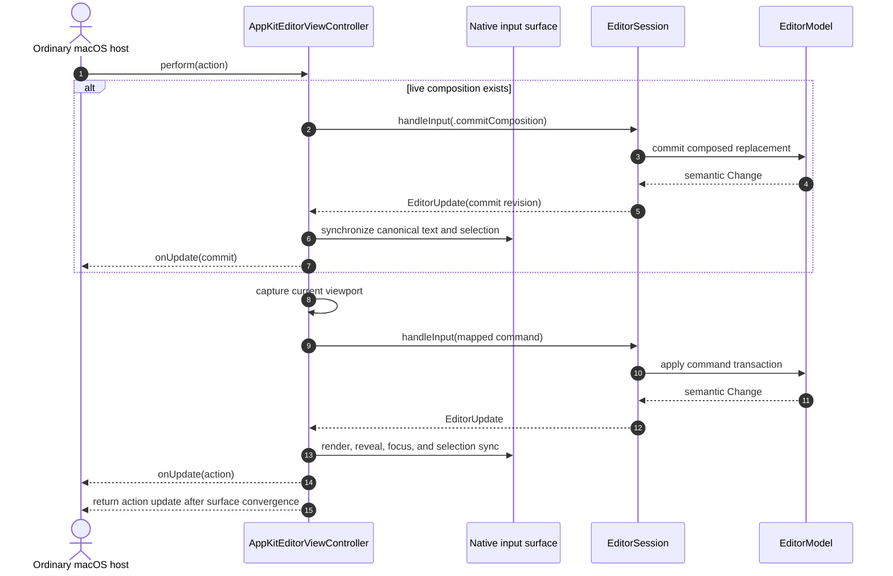
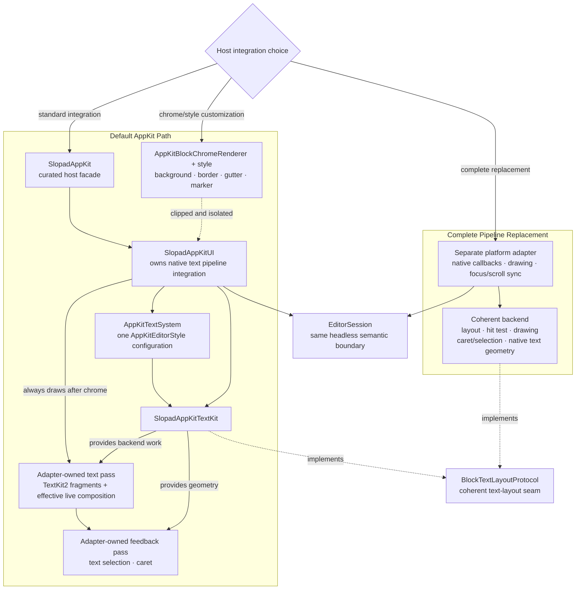
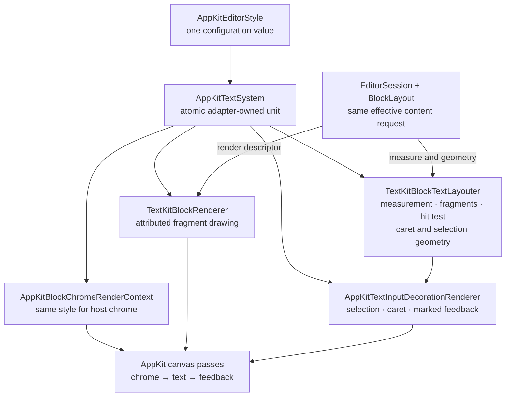

# Architecture

This document explains the current Slopad structure and the principles used to evolve it.
[`Package.swift`](../Package.swift) is the compiler-enforced dependency graph,
[`README.md`](../README.md) is the short structural map, and the ADRs record why durable
boundaries were chosen.

The diagrams deliberately separate two different relationships:

- **SwiftPM dependency arrows** describe which target can import another target at
  compile time.
- **Runtime collaboration arrows** describe which object owns state and which values or
  callbacks cross an owner boundary.

`SlopadAppKit` appears in the dependency graph because it is a module/product facade. It
does not appear as a runtime owner because it creates no object and stores no editor state.

## Production Target Graph



Arrows show direct SwiftPM target dependencies. Debug apps, benchmarks, tests, and the
downstream fixture are outer-edge consumers and are intentionally omitted from the
production graph.

The graph is also a design constraint:

- `SlopadEditorModel` and `SlopadBlockLayout` do not import each other.
- `SlopadEngine` composes both owners and translates semantic changes into layout work.
- `SlopadAppKitTextKit` implements vocabulary defined by `SlopadCoreModel`; it does not
  depend on `SlopadEngine` or own a native input surface.
- `SlopadAppKitUI` is the runtime integration point for the default macOS path.
- `SlopadAppKit` is the recommended ordinary host product/import. It curates the default
  AppKit stack without becoming another runtime or semantic owner.

## Outer-Edge Consumers

| Consumer | Role | Contract status |
| --- | --- | --- |
| `SlopadDebugApp` | Reference host, scenario runner, screenshots, state assertions | Executable product; not a production owner |
| `SlopadUIBenchmarkApp` | AppKit frame and interaction benchmark harness | Executable product; not a reusable library surface |
| `SlopadHeightBenchmark` | Height-index and layout benchmark | Development target without a product |
| `SlopadSessionBenchmark` | Engine/session benchmark | Development target without a product |
| `Fixtures/DownstreamAppKitHost` | Compile-time proof of the one-product, one-import ordinary host contract | Separate fixture package; depends on and imports only `SlopadAppKit`, without `@testable` or package access |

Tests also consume the target that owns the behavior under test. Their folder structure
mirrors responsibility rather than production file symmetry.

## Runtime Collaboration



The engine-side arrows to `SlopadAppKitTextKit` describe runtime dispatch through the
injected `BlockTextLayoutProtocol` value, not a SwiftPM dependency on the concrete
backend. `SlopadAppKit` does not appear as a separate runtime box because it is a curated
compile-time facade, not an additional controller or state owner. The arrows describe
collaboration, not shared ownership. In particular:

- The canonical `Document` and `Block` value types are defined in `SlopadCoreModel`, but
  `EditorModel` owns their stored state and mutation invariants.
- `BlockLayout` owns layout caches, visible order, y/height storage, geometry rules, and
  the read-only projection that applies live composition to effective block content.
  Those values are projections of canonical state, not a second editor model.
- `EditorSession` owns runtime orchestration, including the live composition overlay, and
  assembles snapshots. It does not absorb the canonical or layout owners.
- `EditorDocumentSnapshot` is the complete persistence-facing projection of the canonical
  model. Its blocks use depth-first preorder and never derive from visible layout. A
  Session-local monotonic revision signal distinguishes committed mutations from runtime
  updates; it is not a host storage revision.
- Selection inside marked text is also a Session overlay in effective-text coordinates.
  Update/snapshot projections may expose it while composition is live, but
  `EditorModel.selection` remains in canonical document coordinates.
- `SlopadAppKitUI` transports native marked-text callbacks and applies native feedback.
  Commit/cancel and selection-transition meaning still comes from `EditorSession`.
- Native character/word selectors carry the current viewport into Session. Session supplies
  the effective block request, the text backend resolves bidi/linguistic selection facts,
  and Session alone applies selection, block transitions, deletion, and history semantics.
- The backend may return transient inline navigation context when logical offset and
  affinity alone do not identify the active visual caret in a bidirectional run. Session
  retains it only for the exact selection and effective request; selection, content,
  layout-backend, or request changes invalidate it.

## Ordinary AppKit Host Facade and Advanced Seams

An ordinary macOS host declares only the `SlopadAppKit` product and writes
`import SlopadAppKit`. The facade exports a curated platform vocabulary: the controller,
`AppKitEditorAction`, `AppKitEditorStyle`, block chrome contract, host document inputs,
selection values, updates, render snapshots, and the complete `EditorDocumentSnapshot`.
It also exports the document context, selected-content, patch, source, and typed error
values used by review-before-apply integrations. It does not duplicate those values or own
runtime state.

The default controller surface is intentionally narrower than the raw engine surface.
Programmatic editing goes through `perform(_:)` with a context-free
`AppKitEditorAction`; the controller captures its current viewport when the corresponding
engine command needs geometry. `commitActiveComposition()` is the explicit lifecycle
flush for a host that must persist, replace, or close a document. `focus`,
`resetDocument`, `scrollDocument`, `updateEditorStyle`, `onUpdate`, render snapshots, and
full-document snapshots remain synchronized host contracts. Raw `EditorInputEvent` and
`currentViewport` are not public on `AppKitEditorViewController`.

The narrower default facade does not remove the engine extension boundary.
`EditorSession.handleInput(_:)`, `EditorInputEvent`, `EditorViewport`, and
`BlockTextLayoutProtocol` remain public for a host implementing a complete custom adapter.
The `SlopadEngine`, `SlopadAppKitUI`, and `SlopadAppKitTextKit` products also remain
available as advanced or compatibility seams. This preserves existing integrations
without making their lower-level assembly the recommended path.

### Public Surface Migration

| Concern | Previous ordinary-host usage | Facade usage | Why the owner changes |
| --- | --- | --- | --- |
| SwiftPM assembly | Depend on `SlopadEngine`, `SlopadAppKitUI`, and `SlopadAppKitTextKit` | Depend on `SlopadAppKit` | The default adapter/backend pair is one supported platform stack |
| Imports | Import three implementation modules | `import SlopadAppKit` | The facade curates only ordinary host vocabulary |
| Programmatic commands | Build `EditorInputEvent.Command`, sometimes with a host-supplied viewport | `perform(AppKitEditorAction)` | The controller already owns viewport and surface synchronization |
| IME lifecycle flush | Inject raw `.commitComposition` | `commitActiveComposition()` | Native marked state and Session composition must settle together |
| Style | Name the backend type `TextKitEditorStyle` | Use `AppKitEditorStyle` | The public value configures the complete default AppKit text system |
| Complete custom adapter | Import and drive the same ordinary controller surface | Import `SlopadEngine` and implement the full adapter/backend pair | Raw input remains an advanced engine seam, not a default-controller escape hatch |

### Synchronized Programmatic Action Flow



`perform(_:)` commits live composition before applying the requested action. A call made
during composition can therefore publish two `onUpdate` values—one for the composition
commit and one for the action—while its return value is the requested action's update.
`commitActiveComposition()` executes only the composition branch and is the explicit
lifecycle operation for save, document replacement, or close. Both paths re-read the
canonical result when commit-time normalization, such as a Markdown prefix shortcut,
changes the native buffer text or selection.

## Reviewable Atomic Document Transactions

`documentContextSnapshot()` and `applyDocumentPatch(_:)` are sibling Session/controller
APIs. They do not become `AppKitEditorAction` cases because they carry a captured canonical
document context rather than a context-free host intent. The engine contract is available
to complete custom adapters, and the AppKit controller adds native marked-text rejection
plus synchronized surface forwarding.

```mermaid
sequenceDiagram
    autonumber
    actor Host as Reviewing host or assistant coordinator
    participant AppKit as AppKitEditorViewController
    participant Session as EditorSession
    participant Model as EditorModel
    participant Surface as AppKit surface and observers

    Host->>AppKit: documentContextSnapshot()
    AppKit->>AppKit: reject native marked text
    AppKit->>Session: documentContextSnapshot()
    Session->>Session: reject composition
    Session-->>Host: full document + exact selection + selected content + opaque source
    Note over Host: Build and review canonical full post-image
    Host->>AppKit: applyDocumentPatch(source, replacementBlocks, selectionAfter)
    AppKit->>Session: synchronized forwarding
    Session->>Session: exact CAS(epoch + revision + selection)
    Session->>Model: validate and replace full post-image
    alt empty, duplicate, invalid content, missing parent, cycle, non-DFS, or invalid selection
        Model-->>Host: typed error; state unchanged
    else exact document and selection no-op
        Model-->>Host: nil; no history, revision, callback, or render
    else changed post-image
        Model-->>Session: one transaction and one semantic change
        Session-->>AppKit: one committed-revision EditorUpdate
        AppKit->>Surface: one callback, then native/render convergence
        AppKit-->>Host: matching update
    end
```

The opaque `EditorDocumentSource` is a compare-and-swap token, not a persistence or API
version. It captures a per-Session epoch, the committed document revision, and exact
selection. All three must match. The epoch rejects reset ABA even when a replacement
Session starts again at revision zero with the same document and selection; exact
selection comparison rejects a selection-only move that does not advance the persistence
revision.

Selection projection is canonical, not viewport-derived:

- `TextSelection` may span blocks for context projection. Fragments are ordered by the
  canonical document DFS, carry block ID, parent, kind, and source range, and slice
  `BlockContent` with inline marks rebased to fragment-relative offsets.
- `BlockSelection` is normalized to canonically ordered roots after removing descendants
  already covered by a selected ancestor. Each root's complete subtree is then emitted in
  canonical DFS order.
- caret and inactive selections produce `.none` selected content while the exact selection
  remains present in the context and source CAS.

These context and selected-content values are Session-produced output projections. Their
initializers are not public, and selected-content values are `Encodable` but not
`Decodable`; a host can send the projection to a reviewer without manufacturing or
decoding unchecked source/document/selection combinations. `EditorDocumentPatch` remains
the public host-constructed input.

The full post-image is validated before mutation: it must be non-empty, have unique IDs,
contain canonical `BlockContent` marks for the current text, reference existing parents,
be acyclic, already use canonical parent-before-child DFS order, and contain a valid
selection. Validation and invariant preorder traversal use iterative stacks, so hierarchy
depth does not turn a public typed-error boundary into a process stack trap. `EditorModel`
installs valid input as one snapshot-backed transaction. Because an external post-image
can replace content and canonical visible order while retaining block IDs, Session starts
a fresh derived `BlockLayout` state before the next synchronized render.

### Snapshot Purpose Boundary

| Projection | Primary consumer | Selection/composition | Lifetime and authority |
| --- | --- | --- | --- |
| `EditorSessionSnapshot` | Renderer/platform adapter | Effective selection and live composition | Viewport/runtime projection only |
| `EditorDocumentSnapshot` | Persistence host | Excludes both | Complete immutable canonical read; revision is a Session-local observation signal |
| `EditorDocumentContextSnapshot` | Review-before-apply host | Exact selection and structured selected content; composition is rejected | Short-lived CAS context; only its opaque source can authorize `applyDocumentPatch(_:)` |

`EditorDocumentContextSnapshot.document` reuses `EditorDocumentSnapshot` so canonical
tree representation has one public shape. The context does not turn the persistence
snapshot or its revision into a mutation credential.

## Default AppKit Path and Full Replacement



`AppKitBlockChromeRenderer` is an appearance boundary, not a partial text renderer. It
cannot suppress, replace, or duplicate the fragment pass—including effective live
composition—or the following selection and caret pass. A complete native text pipeline
replacement remains possible, but it requires a separate platform adapter and a backend
that keeps every geometry operation coherent.

`AppKitEditorViewController` owns one `AppKitTextSystem`. A single
`AppKitEditorStyle` value configures its TextKit2 layouter, fragment renderer, IME
decoration geometry, and the style supplied to chrome rendering. Runtime style
replacement constructs the new system as one unit, replaces the Session backend, and
publishes the synchronized result. Geometry and drawing therefore cannot accidentally
use different style revisions.

### Coherent AppKit Text System



The unit is replaced as a whole. No public hook can swap only fragment painting while
leaving measurement, hit testing, caret geometry, or native text feedback on another
configuration. `AppKitBlockChromeRenderer` receives the same style but remains clipped
decoration; it does not participate in text shaping.

## Responsibility Matrix

| Owner | Owns | Must not own |
| --- | --- | --- |
| `SlopadEditorModel` | Stored document, block identity, selection, commands, transactions, history, semantic changes, validated atomic full post-image replacement | Layout caches, y offsets, native callbacks, live platform geometry |
| `SlopadBlockLayout` | Effective content projection, visible order, y/height index, text-layout cache, invalidation, hit/reveal geometry, marker projection | Canonical mutation, command semantics, AppKit/TextKit2 types |
| `SlopadEngine` / `EditorSession` | Host facade, runtime composition overlay, semantic-to-layout orchestration, render snapshot/update assembly, persistence projection, exact context/source CAS and selected-content projection | Platform widgets, canonical storage duplication, backend implementation details |
| `SlopadAppKit` | Curated ordinary-host import surface for the default macOS stack | Runtime state, editor semantics, native callback handling, backend implementation |
| `SlopadAppKitUI` | Native callback translation, native text pipeline integration, fragment/feedback drawing order, focus/scroll/canvas synchronization | Editor semantics, canonical state, arbitrary whole-text paint hooks |
| `SlopadAppKitTextKit` | TextKit2 fragment layout, caret/selection geometry, text hit testing, bidi/Unicode word navigation, attributed content and drawing helpers | Native view/input host, canonical editor state, Session orchestration |
| `SlopadCoreModel` | Cross-boundary vocabulary, backend seam values, canonical value definitions | Owner-specific caches, policies, projections, generic helpers |
| `SlopadDataStructure` | Pure reusable storage algorithms | Editor, block, layout, or platform concepts |

## Architecture Philosophy

### One Meaning, One Authority

Every invariant has one final owner. Other layers may cache, project, serialize, or draw
that meaning, but those representations do not become competing sources of truth.

### Meaning Stays Headless; Native Mechanism Stays at the Edge

The engine decides what an input means: selection transitions, block operations,
composition lifecycle, commands, and history. Platform adapters decide how OS callbacks
are collected and how returned facts are realized through native drawing, focus, and
scrolling.

### A Backend Seam Is a Coherent Geometry Contract

`EditorSession` owns the live composition overlay, and `BlockLayout` projects it into the
effective block request. Text measurement, line fragments, hit testing, caret and
selection rectangles, physical/linguistic navigation, and drawing consume that same
effective request and must agree. A high-level paint callback cannot safely replace only
one part of this contract. Any layout-derived navigation context is a disposable Session
runtime projection, never canonical editor state.

### Compiler Boundaries Are Architecture Boundaries

SwiftPM dependencies point toward stable vocabulary and pure storage. `public` is for
downstream host contracts, `package` is for real cross-target owner interfaces, and
target-internal implementation remains unannotated or private.

### Public Adapter Actions Are Atomic Boundaries

A public AppKit operation returns only after its relevant Session snapshot, viewport,
canvas, native input state, focus state, and observer publication agree. Package-only
no-render helpers exist for development harnesses that explicitly perform the later
render/synchronization step. Ordinary programmatic editing uses `perform(_:)`; lifecycle
composition flushes use `commitActiveComposition()`. Native key, pointer, and IME event
translation plus viewport acquisition remain inside the adapter.

### Mutable Sessions Stay on One Executor

`EditorSession` is a synchronous mutable runtime, not a `Sendable` value. The executor that
creates a Session owns it for its lifetime and calls it serially. Platform adapters choose
that executor—the default AppKit adapter uses `MainActor`—while `Sendable` inputs, updates,
and snapshots may cross isolation boundaries. This keeps the headless engine independent
of a global UI actor without making an unchecked thread-safety promise.

### Persistence Reads Canonical State, Not Render State

`EditorUpdate.committedDocumentRevision` identifies a canonical content or structure
commit within one Session. A host reads the matching `EditorDocumentSnapshot` synchronously
on that Session's executor only when it needs the complete tree. Selection, scrolling,
layout, and live composition do not advance the revision. The projection is `Sendable`, but
the Session remains confined. `EditorSessionSnapshot.visibleBlocks` is a viewport render
projection and must never be reconstructed into persistence content.

Review-before-apply reads use `EditorDocumentContextSnapshot` instead. Its opaque source
is intentionally invalidated by document, selection, or Session identity changes and must
not be retained as a persistence revision. Active composition is rejected so canonical
content, exact selection, native marked text, and the later post-image never describe
different states.

### Outer Consumers Verify; They Do Not Define

`SlopadDebugApp`, benchmark targets, tests, and fixtures consume production layers. They
may inspect, measure, and prove a contract, but debug or benchmark convenience is not a
reason to widen production API. `Fixtures/DownstreamAppKitHost` is the compile-time proof
of the intended one-product `SlopadAppKit` surface.

## Change Decision Checklist

Before changing a layer boundary, answer these questions:

1. Which layer has final authority over the invariant?
2. Is the new value canonical state, runtime state, a projection, a cache, an input, or a
   backend seam value?
3. Does the proposed dependency follow the SwiftPM graph, or does it create a second
   owner or reverse edge?
4. For text work, do layout, hit testing, caret/selection geometry, marked content, and
   drawing remain coherent?
5. Is a requested customization truly chrome/style, or does it require a separate
   adapter and backend?
6. Can the behavior be verified through the owning layer and, for public AppKit changes,
   through the downstream fixture?

Related decisions: [ADR 0001](../ADR/0001-headless-session-facade.md),
[ADR 0002](../ADR/0002-swiftpm-target-graph.md),
[ADR 0003](../ADR/0003-text-layout-backend-seam.md),
[ADR 0007](../ADR/0007-appkit-ui-adapter-package.md),
[ADR 0008](../ADR/0008-keep-editor-session-executor-confined.md),
[ADR 0009](../ADR/0009-publish-committed-document-snapshots.md),
[ADR 0010](../ADR/0010-appkit-platform-facade.md), and
[ADR 0011](../ADR/0011-reviewable-atomic-document-transactions.md).
