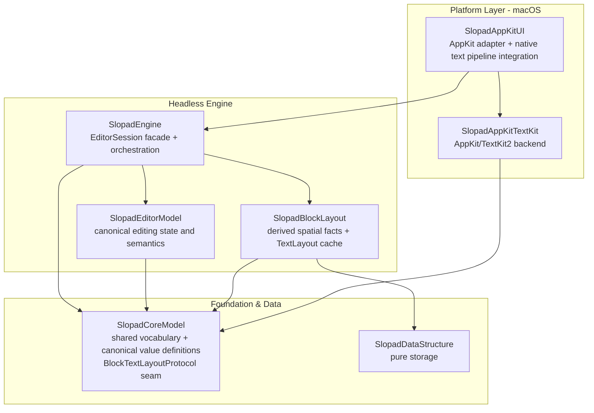
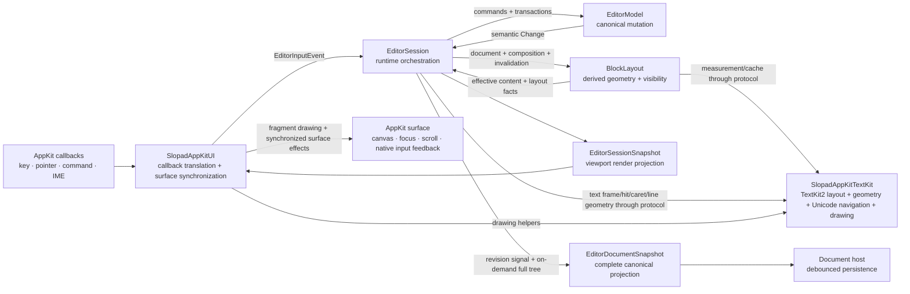
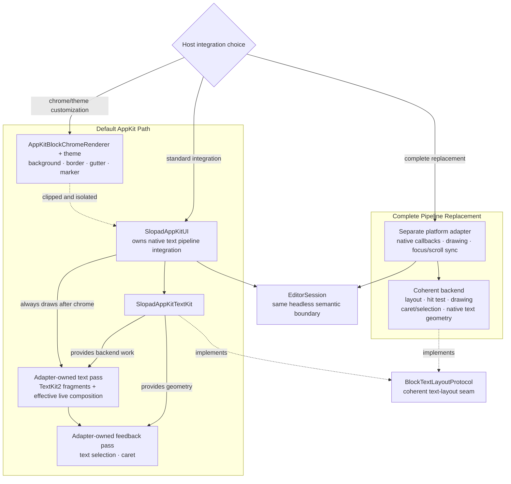

# Architecture

This document explains the current Slopad structure and the principles used to evolve it.
[`Package.swift`](../Package.swift) is the compiler-enforced dependency graph,
[`README.md`](../README.md) is the short structural map, and the ADRs record why durable
boundaries were chosen.

## Production Target Graph

Arrows show direct SwiftPM target dependencies. Debug apps, benchmarks, tests, and the
downstream fixture are outer-edge consumers and are intentionally omitted from the
production graph.

The graph is also a design constraint:

- `SlopadEditorModel` and `SlopadBlockLayout` do not import each other.
- `SlopadEngine` composes both owners and translates semantic changes into layout work.
- `SlopadAppKitTextKit` implements vocabulary defined by `SlopadCoreModel`; it does not
  depend on `SlopadEngine` or own a native input surface.
- `SlopadAppKitUI` is the integration point for the default macOS path.

## Outer-Edge Consumers

| Consumer | Role | Contract status |
| --- | --- | --- |
| `SlopadDebugApp` | Reference host, scenario runner, screenshots, state assertions | Executable product; not a production owner |
| `SlopadUIBenchmarkApp` | AppKit frame and interaction benchmark harness | Executable product; not a reusable library surface |
| `SlopadHeightBenchmark` | Height-index and layout benchmark | Development target without a product |
| `SlopadSessionBenchmark` | Engine/session benchmark | Development target without a product |
| `Fixtures/DownstreamAppKitHost` | Compile-time proof of ordinary public imports | Separate fixture package; must not use `@testable` or package access |

Tests also consume the target that owns the behavior under test. Their folder structure
mirrors responsibility rather than production file symmetry.

## Runtime Collaboration

The engine-side arrows to `SlopadAppKitTextKit` describe runtime dispatch through the
injected `BlockTextLayoutProtocol` value, not a SwiftPM dependency on the concrete
backend. The arrows describe collaboration, not shared ownership. In particular:

- The canonical `Document` and `Block` value types are defined in `SlopadCoreModel`, but
  `EditorModel` owns their stored state and mutation invariants.
- `BlockLayout` owns layout caches, visible order, y/height storage, geometry rules, and
  the read-only projection that applies live composition to effective block content.
  Those values are projections of canonical state, not a second editor model.
- `EditorSession` owns runtime orchestration, including the live composition overlay, and
  assembles snapshots. It does not absorb the canonical or layout owners.
- `EditorDocumentSnapshot` is the complete persistence-facing projection of the canonical
  model. Its blocks use depth-first preorder and never derive from visible layout. A
  Session-local monotonic revision signal distinguishes committed mutations from runtime
  updates; it is not a host storage revision.
- Selection inside marked text is also a Session overlay in effective-text coordinates.
  Update/snapshot projections may expose it while composition is live, but
  `EditorModel.selection` remains in canonical document coordinates.
- `SlopadAppKitUI` transports native marked-text callbacks and applies native feedback.
  Commit/cancel and selection-transition meaning still comes from `EditorSession`.
- Native character/word selectors carry the current viewport into Session. Session supplies
  the effective block request, the text backend resolves bidi/linguistic selection facts,
  and Session alone applies selection, block transitions, deletion, and history semantics.
- The backend may return transient inline navigation context when logical offset and
  affinity alone do not identify the active visual caret in a bidirectional run. Session
  retains it only for the exact selection and effective request; selection, content,
  layout-backend, or request changes invalidate it.

## Default AppKit Path and Full Replacement

`AppKitBlockChromeRenderer` is an appearance boundary, not a partial text renderer. It
cannot suppress, replace, or duplicate the fragment pass—including effective live
composition—or the following selection and caret pass. A complete native text pipeline
replacement remains possible, but it requires a separate platform adapter and a backend
that keeps every geometry operation coherent.

## Responsibility Matrix

| Owner | Owns | Must not own |
| --- | --- | --- |
| `SlopadEditorModel` | Stored document, block identity, selection, commands, transactions, history, semantic changes | Layout caches, y offsets, native callbacks, live platform geometry |
| `SlopadBlockLayout` | Effective content projection, visible order, y/height index, text-layout cache, invalidation, hit/reveal geometry, marker projection | Canonical mutation, command semantics, AppKit/TextKit2 types |
| `SlopadEngine` / `EditorSession` | Host facade, runtime composition overlay, semantic-to-layout orchestration, render snapshot/update assembly, on-demand complete canonical projection | Platform widgets, canonical storage duplication, backend implementation details |
| `SlopadAppKitUI` | Native callback translation, native text pipeline integration, fragment/feedback drawing order, focus/scroll/canvas synchronization | Editor semantics, canonical state, arbitrary whole-text paint hooks |
| `SlopadAppKitTextKit` | TextKit2 fragment layout, caret/selection geometry, text hit testing, bidi/Unicode word navigation, attributed content and drawing helpers | Native view/input host, canonical editor state, Session orchestration |
| `SlopadCoreModel` | Cross-boundary vocabulary, backend seam values, canonical value definitions | Owner-specific caches, policies, projections, generic helpers |
| `SlopadDataStructure` | Pure reusable storage algorithms | Editor, block, layout, or platform concepts |

## Architecture Philosophy

### One Meaning, One Authority

Every invariant has one final owner. Other layers may cache, project, serialize, or draw
that meaning, but those representations do not become competing sources of truth.

### Meaning Stays Headless; Native Mechanism Stays at the Edge

The engine decides what an input means: selection transitions, block operations,
composition lifecycle, commands, and history. Platform adapters decide how OS callbacks
are collected and how returned facts are realized through native drawing, focus, and
scrolling.

### A Backend Seam Is a Coherent Geometry Contract

`EditorSession` owns the live composition overlay, and `BlockLayout` projects it into the
effective block request. Text measurement, line fragments, hit testing, caret and
selection rectangles, physical/linguistic navigation, and drawing consume that same
effective request and must agree. A high-level paint callback cannot safely replace only
one part of this contract. Any layout-derived navigation context is a disposable Session
runtime projection, never canonical editor state.

### Compiler Boundaries Are Architecture Boundaries

SwiftPM dependencies point toward stable vocabulary and pure storage. `public` is for
downstream host contracts, `package` is for real cross-target owner interfaces, and
target-internal implementation remains unannotated or private.

### Public Adapter Actions Are Atomic Boundaries

A public AppKit operation returns only after its relevant Session snapshot, viewport,
canvas, native input state, focus state, and observer publication agree. Package-only
no-render helpers exist for development harnesses that explicitly perform the later
render/synchronization step.

### Mutable Sessions Stay on One Executor

`EditorSession` is a synchronous mutable runtime, not a `Sendable` value. The executor that
creates a Session owns it for its lifetime and calls it serially. Platform adapters choose
that executor—the default AppKit adapter uses `MainActor`—while `Sendable` inputs, updates,
and snapshots may cross isolation boundaries. This keeps the headless engine independent
of a global UI actor without making an unchecked thread-safety promise.

### Persistence Reads Canonical State, Not Render State

`EditorUpdate.committedDocumentRevision` identifies a canonical content or structure
commit within one Session. A host reads the matching `EditorDocumentSnapshot` synchronously
on that Session's executor only when it needs the complete tree. Selection, scrolling,
layout, and live composition do not advance the revision. The projection is `Sendable`, but
the Session remains confined. `EditorSessionSnapshot.visibleBlocks` is a viewport render
projection and must never be reconstructed into persistence content.

### Outer Consumers Verify; They Do Not Define

`SlopadDebugApp`, benchmark targets, tests, and fixtures consume production layers. They
may inspect, measure, and prove a contract, but debug or benchmark convenience is not a
reason to widen production API. `Fixtures/DownstreamAppKitHost` is the compile-time proof
of the intended public AppKit surface.

## Change Decision Checklist

Before changing a layer boundary, answer these questions:

1. Which layer has final authority over the invariant?
2. Is the new value canonical state, runtime state, a projection, a cache, an input, or a
   backend seam value?
3. Does the proposed dependency follow the SwiftPM graph, or does it create a second
   owner or reverse edge?
4. For text work, do layout, hit testing, caret/selection geometry, marked content, and
   drawing remain coherent?
5. Is a requested customization truly chrome/theme, or does it require a separate
   adapter and backend?
6. Can the behavior be verified through the owning layer and, for public AppKit changes,
   through the downstream fixture?

Related decisions: [ADR 0001](../ADR/0001-headless-session-facade.md),
[ADR 0002](../ADR/0002-swiftpm-target-graph.md),
[ADR 0003](../ADR/0003-text-layout-backend-seam.md),
[ADR 0007](../ADR/0007-appkit-ui-adapter-package.md),
[ADR 0008](../ADR/0008-keep-editor-session-executor-confined.md), and
[ADR 0009](../ADR/0009-publish-committed-document-snapshots.md).
